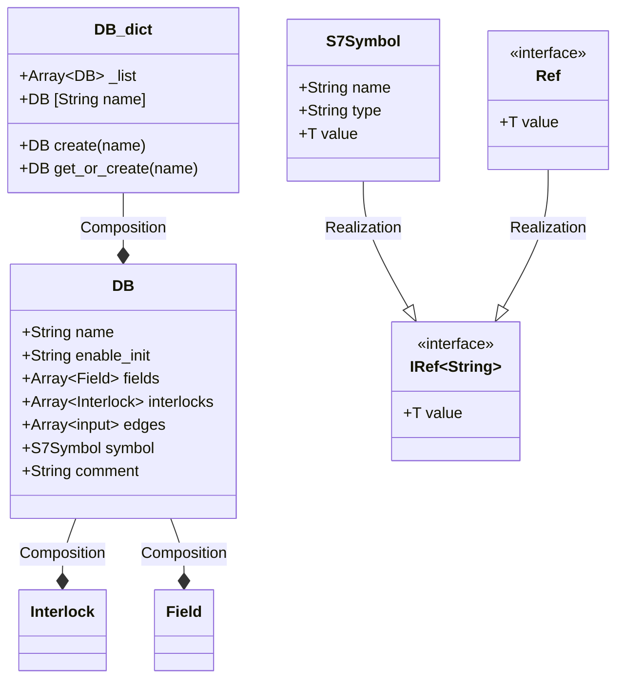
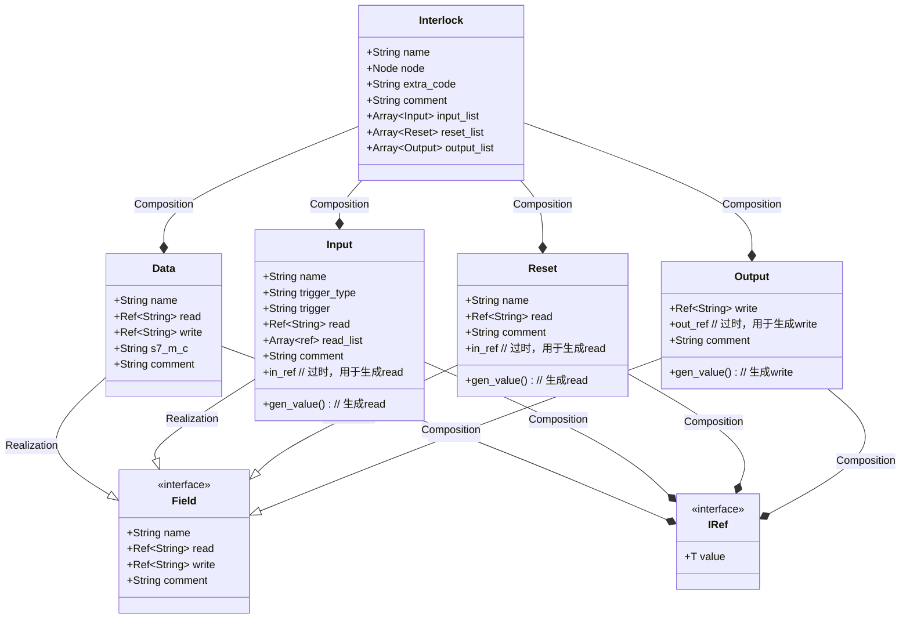

# interlock class

```mermaid
classDiagram

DB_dict --* DB : Composition
DB --* Interlock : Composition
DB --* Field : Composition

class DB_dict{
+Array~DB~ _list
+DB [String name]
+DB create(name)
+DB get_or_create(name)
}

class DB {
+String name
+String enable_init
+Array~Field~ fields
+Array~Interlock~ interlocks
+Array~input~ edges
+S7Symbol symbol
+String comment
}

S7Symbol --|> IRef~String~ : Realization
Ref --|> IRef : Realization

class Ref~T~{
<<interface>>
+T value
}

class S7Symbol~T~{
+String name
+String type
+T value
}

class IRef~T~{
<<interface>>
+T value
}
```

```mermaid
classDiagram

class Field {
<<interface>>
+String name
+Ref~String~ read
+Ref~String~ write
+String comment
}

Interlock --* Data : Composition
Interlock --* Input : Composition
Interlock --* Reset : Composition
Interlock --* Output : Composition
Data --|> Field : Realization
Input --|> Field : Realization
Reset --|> Field : Realization
Output --|> Field : Realization

class Interlock{
+String name
+Node node
+String extra_code
+String comment
+Array~Input~ input_list
+Array~Reset~ reset_list
+Array~Output~ output_list
}

class Data{
+String name
+Ref~String~ read
+Ref~String~ write
+String s7_m_c
+String comment
}

class Input{
+String name
+String trigger_type
+String trigger
+Ref~String~ read
+Array~ref~ read_list
+String comment
+in_ref // 过时，用于生成read
+gen_value() // 生成read
}

class Reset{
+String name
+Ref~String~ read
+String comment
+in_ref // 过时，用于生成read
+gen_value() // 生成read
}

class Output{
+Ref~String~ write
+out_ref // 过时，用于生成write
+String comment
+gen_value() // 生成write
}

Data --* IRef : Composition
Input --* IRef : Composition
Reset --* IRef : Composition
Output --* IRef : Composition

class IRef~T~{
<<interface>>
+T value
}

```
